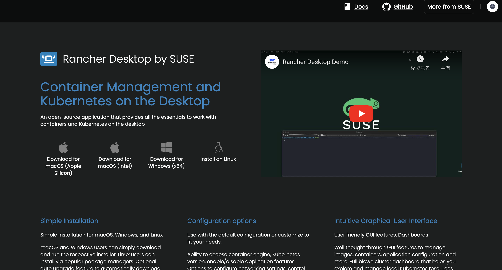
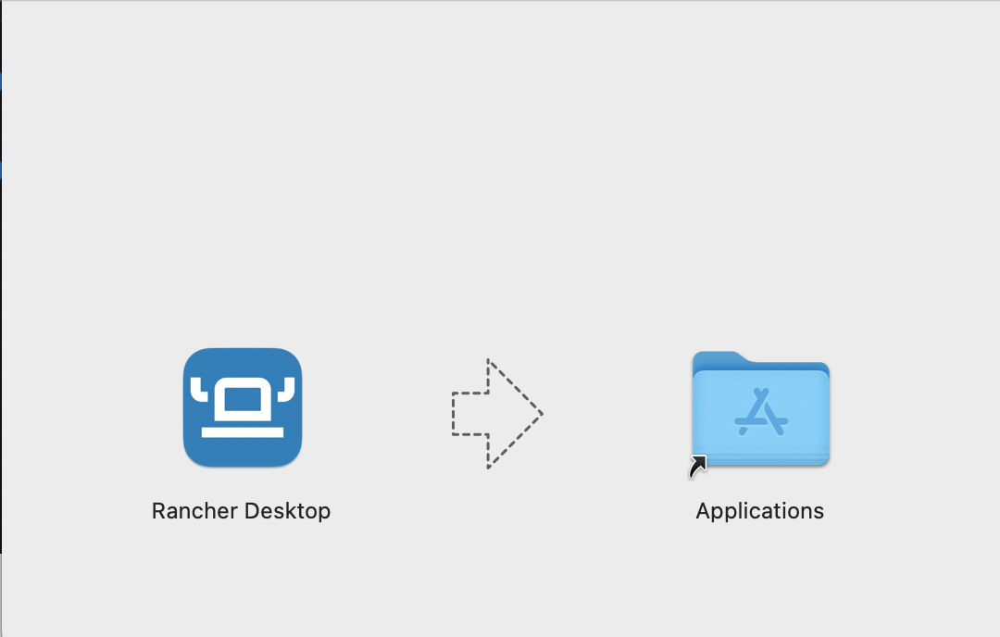
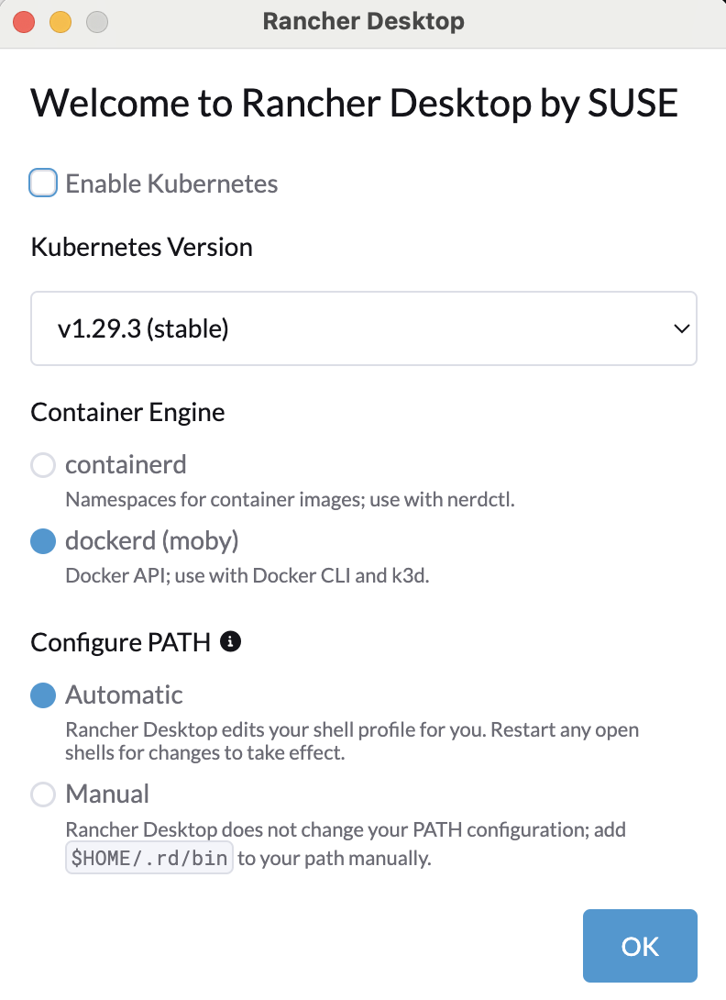

# SocketCommunication

C++とgoでソケット通信を行うプログラムです．

## 筆者の環境
MacOS: Sonoma14.4.1  
メモリ: 16GB  
プロセッサ: 2GHz クアッドコアIntelCore


## 動かし方
server.cppでサーバの作成  
client.goでサーバからのメッセージを受け取る

動かし方(後に記述しているdockerの環境設定を済ませてから動かしましょう)
一番目のコマンドを使用してからしばらく待ちます(筆者の環境では2分ぐらいでした)
```
docker-compose build --no-cache 
docker-compose up
```
Macの場合は Command + Cでとめます．(WindowsはCtrl + C)

## Dockerの環境設定

2024/4/29の時点での情報  

以下のURLへアクセス

https://rancherdesktop.io 



各チップに対応するファイルをダウンロード．


展開して，アプリケーションにドラッグ&ドロップ


以下になるようにoptionを選択．  
Enable Kubernetsを外し, 
docker(moby)を選び，コンフィグPATHはAuto.


残りの設定は基本root全許可とひたすらOKを押す．

以下のコマンドを入力
```
docker --version
```

```
docker version 25.0.4-rd, build c4cd0a9
```
と表示されれば成功(versionは異なっていても問題ない)   環境設定終わり．


### docker command not found と出てきた場合

以下のコマンドを入力.
以下のコマンドではzshrcファイルに追加書き込みしています  
(bashrcを用いている方は 書き込み先をbashrcに変更してください)
```
echo 'export PATH="$HOME/.rd/bin:$PATH"' >> ~/.zshrc
```
このコマンドで~/.zshrcファイル(もしくは~/.bashrc)に
`export PATH="$HOME/.rd/bin:$PATH"`を書き込んでいます．


再読み込みをしてください
```
source ~/.zshrc
```
これでdockerコマンドが使えるはずです，

